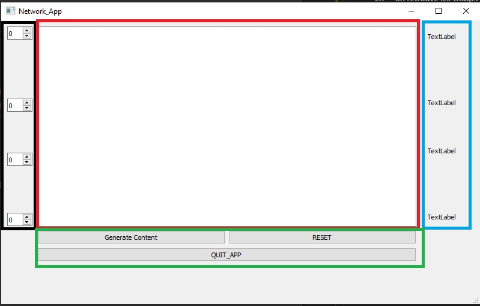

># Compte rendu Projet :
>

 Réseau de Tri

>Guillaume Cuisinier M1

---

Lien vers le dépôt GitHub du projet : https://github.com/Guillaume-Csr/Reseau_de_tri.git

## Introdution

Le réseau de tri, comme son nom l'indique, est un réseau capable de réaliser un tri soit de valeurs ou d'objets. Ici, le but de ce projet est d'utiliser une liste de nombre en désordre et grâce à un systéme de réseau de tri obtenir la liste de nombre trié soit dans un ordre croissant ou décroissant. 

Le réseau de tri est basé sur plusieurs enchaînements de comparaison entre deux éléments à trier puis ranger dans l'ordre selon les critères de tri. On représente ce réseau sous la forme de ligne horizontale reliée par certains endroits avec des noeuds. Les lignes correspondent aux chemins du réseaux qu'emprintent les chiffres. Quant aux noeuds, ils correspondent aux points de comparaison entre les deux nombres présents sur les lignes reliées à un instant T du programme. Ainsi une fois le noeud passé, il en résulte la position des nombres triés par ordre de supériorité ou d'infériorité.

Laissons place au programme pour illustrer tout ceci !

## L'interface

Durant ce projet, j'ai souhaité utiliser l'option Design proposée par Qt pour créer l'interface de mon application. Cette option permet de créer simplement l'application que l'on souhaite sous la forme d'un fichier d'extension ".ui".
Cette méthode va nous permettre de simplifier la rédaction du programme pour générer l'interface graphique. En effet, tous les Widgets sont automatiquement initialisés dans le "mainwindow.ui", et Qt se charge automatiquement de les inscrire dans le même namespace de l'ensemble du projet. Par conséquent, au sein de nos classes, il suffit d'appeler les widgets par leur nom et de programmer leurs actions.

- Au lancement

Ci-dessus voici une capture d'écran de l'application découpée en plusieurs parties.

  
  Application au lancement

En noir, on retrouve les widgets permettant l'insertion des nombres à trier.

En rouge, on retrouve l'écran sur lequel sera affiché le réseau comprenant ainsi les lignes et les noeuds.

En bleu, on retrouve les QLabel qui sont des widgets où sera affiché le résultat de la comparaison. Les nombres sont ainsi triés dans un ordre croissant, le plus petit étant placé en haut.

En vert, on retrouve les boutons principaux permettant de commander l'application. 
**Generate Content** permet de générer, une fois la liste de nombre inscrite, le réseau de tri sous sa représentation graphique avec une couleur correspondant au chemin que parcourt chaque chiffre jusqu'à la phase de tri final.

**Reset** permet de réinitialiser l'application à ses valeurs par défaut.

**Quit** permet de quitter l'application.

- En fonction

  
  Application une fois le contenu généré avec solution

L'affichage graphique est généré sur un QGraphicView qui est ensuite géré par la classe MyScenne du projet. On y retrouve les librairies permettant de créer les éléments qui composent l'affichage à savoir QWidget et QObject. QObject va permettre d'appeler des méthodes tel que AddLine et AddRect qui vont permettre de créer les lignes et les noeuds de l'affichage. On utilise la librairie QPen pour pouvoir générer les chemins de chaque chiffre à la couleur qui lui est attribuée.

## Conclusion

A travers ce projet, j'ai pu découvrir le principe de fonctionnement du réseau de tri ainsi que son interprétation graphique. Ce qui a été compliqué pour moi au sein de ce projet, est de mettre en place l'algorythme permettant l'affichage des lignes à chaque comparaison de deux nombres. En revanche, j'ai été satisfait d'avoir pu mener ce projet jusqu'au but final.